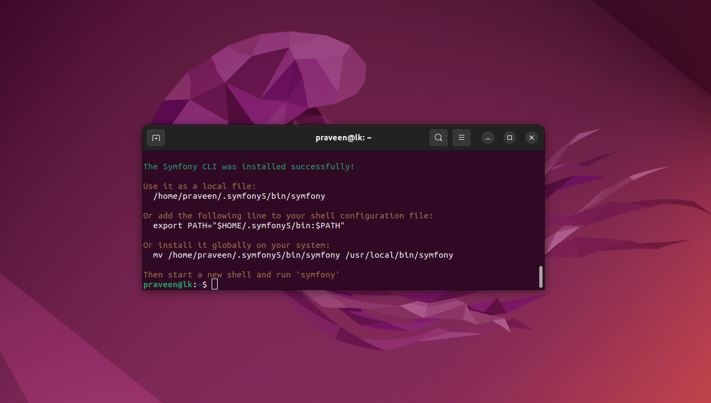
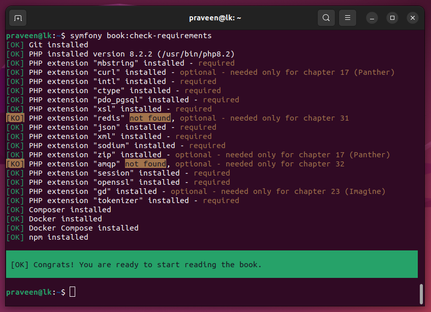
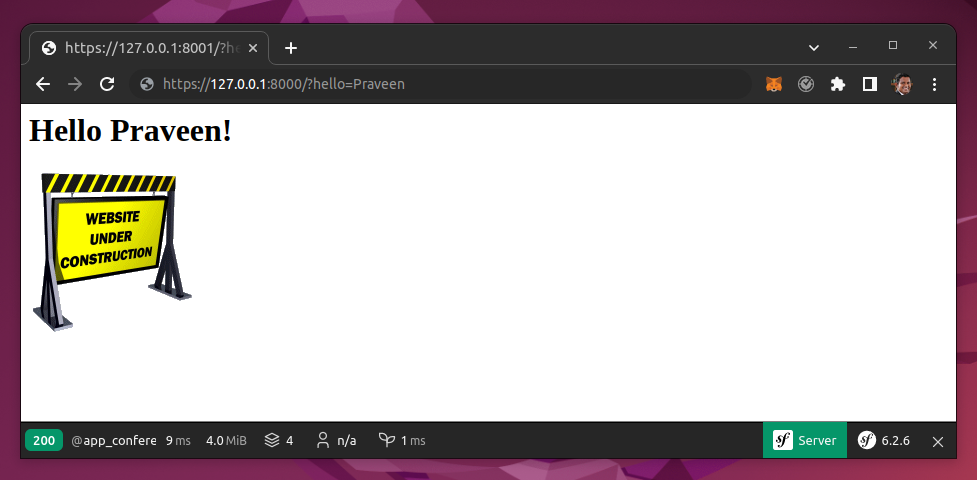
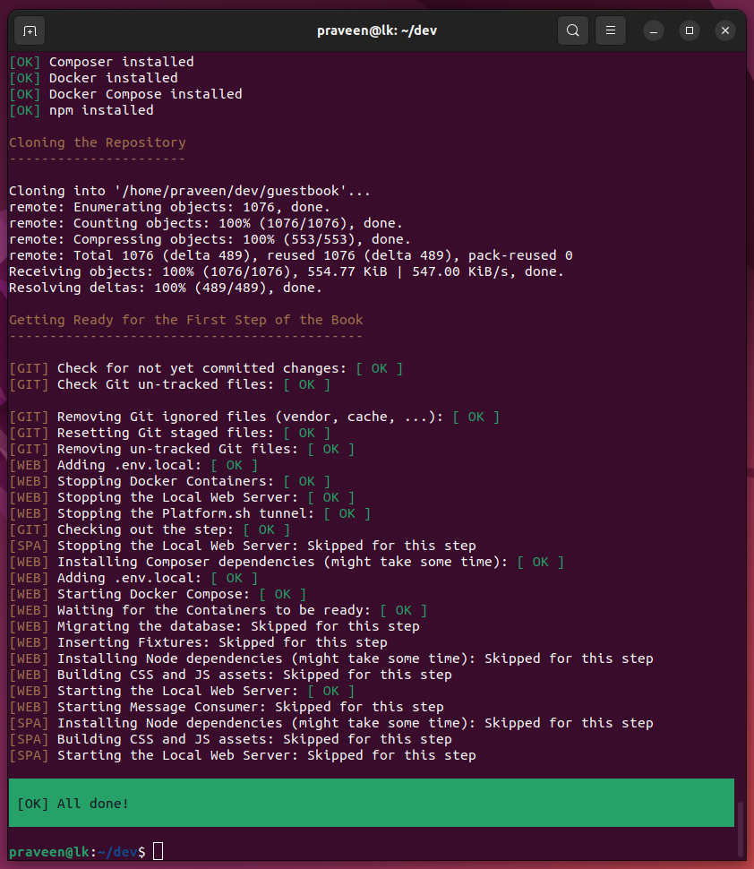
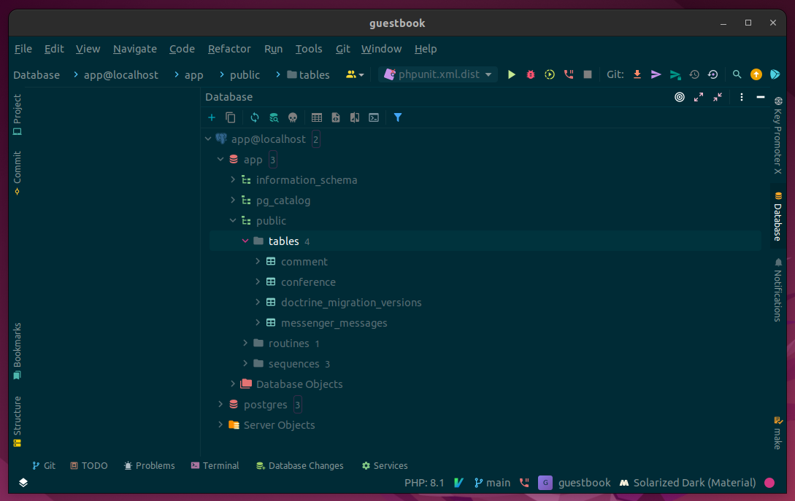
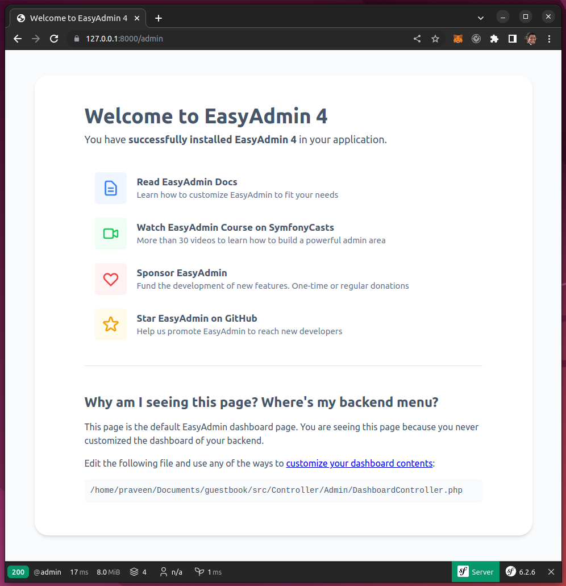
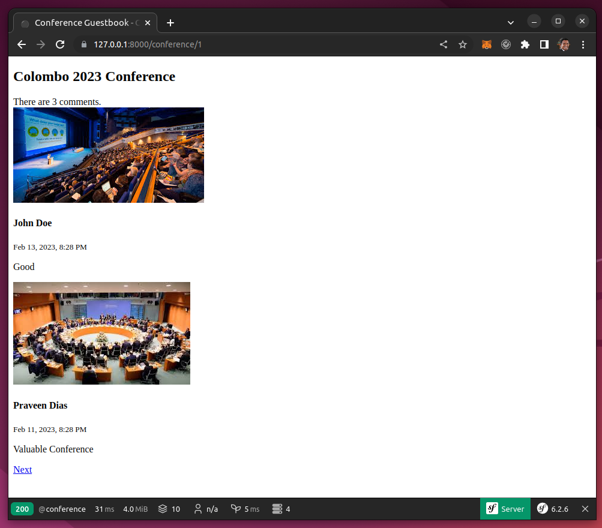

# Symfony - Fast Track


https://symfony.com/doc/6.2/the-fast-track/en/index.html

# Hello, Praveen






# Postgres

```bash
docker run -p 5432:5432 -e POSTGRES_PASSWORD=secret -e POSTGRES_USER=app --name db -d postgres:15-alpine
```

```bash
psql -h localhost -U app
```



# EasyAdmin 4



# UI



