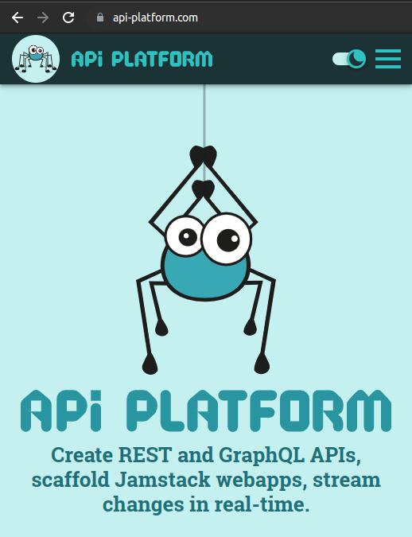
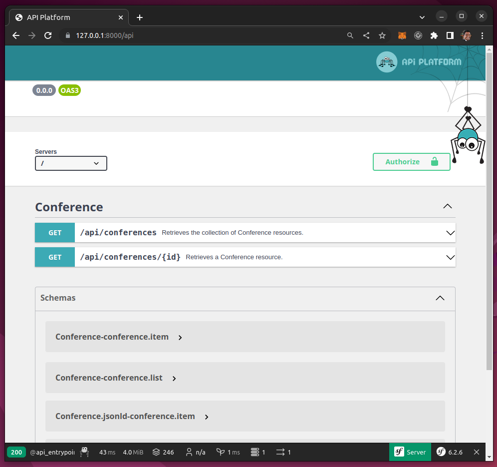
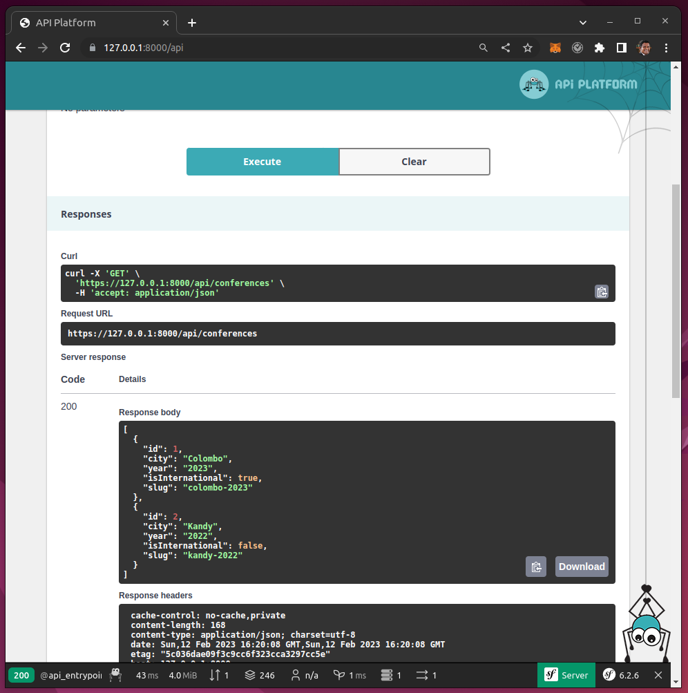

# Symfony - Fast Track


https://symfony.com/doc/6.2/the-fast-track/en/index.html

# Hello, Praveen


# Postgres

```bash
docker run -p 5432:5432 -e POSTGRES_PASSWORD=secret -e POSTGRES_USER=app --name db -d postgres:15-alpine
```

```bash
psql -h localhost -U app
```


# EasyAdmin 4


# UI


# Update existing table with NOT NULL

```
public function up(Schema $schema): void
{
    $this->addSql('ALTER TABLE conference ADD slug VARCHAR(255)');
    $this->addSql("UPDATE conference SET slug=CONCAT(LOWER(city), '-', year)");
    $this->addSql('ALTER TABLE conference ALTER COLUMN slug SET NOT NULL ');
}
```

# Api Platform

https://api-platform.com/







